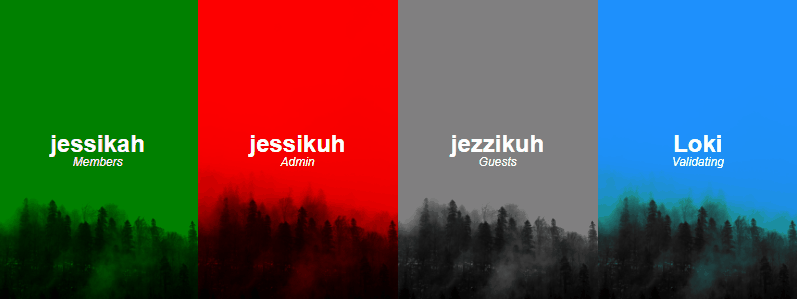

# JcInk Custom Member List

Manipulate JcInk's default /index.php?act=Members.

## Installation

Download and host a copy of [memberlist.min.js](https://raw.githubusercontent.com/jessikuh/jcink-custom-member-list/master/src/js/memberlist.min.js), and place it before the closing body tag (`</body>`) of your Board Wrapper.

```html
<script src="/memberlist.min.js"></script>
```

You may also use a hosted copy for free. The only caveat is that this file will likely receive the latest updates and could break your code. You can keep up with any changes by visiting the [changelog](./CHANGELOG.md).

```html
<script src="https://files.jcink.net/uploads/jessikuh/javascript/memberlist_min.js"></script>
```

## Usage

Now begins the fun: initializing your custom member list! There are currently five variables that you can call for your custom member list.

|Variable|Value returned|
|-|-|
|`{{name}}`|The member's name.|
|`{{group}}`|The member's group.|
|`{{posts}}`|The member's posts.|
|`{{level}}`|The member's level.|
|`{{joined}}`|The day the member joined.|

To initialize your custom member list, insert the code below anywhere **BEFORE** memberlist.min.js.

```html
<script>
  var customMemberList = '<p>{{name}}</p><p>{{group}}</p><p>{{posts}}<br />{{level}}<br />{{joined}}</p>';
</script>
```

You can swap out the HTML for whatever you like as long as it is kept within the apostrophes (var customMemberList = 'STAY BETWEEN THESE APOSTROPHES'). Below is an example of more robust HTML usage.

```html
<script>
  var customMemberList = '<div class="name">{{name}}</div><div class="group">{{group}}</div><div class="otherData">{{posts}}<br />{{level}}<br />{{joined}}</div>';
</script>
```

You are not required to use all five variables. Pick and choose as you please!

**Important Note**: If you use an apostrophe anywhere in your customMemberList variable, it must begin with a forward slash to prevent the code from breaking. Provided below is an example of using an apostrophe within the 'customMemberList' variable.

```html
<script>
  var customMemberList = '<div class="name">{{name}}\'s Profile</div><div class="group">{{group}}</div><div class="otherData">{{posts}}<br />{{level}}<br />{{joined}}</div>';
</script>
```

### CSS

The remaining step is to style your member list. There are three classes that wrap your member list before your custom code comes into play, and can be styled to fit your needs.

|Class|What it styles|
|-|-|
|.member-list|The container of your entire member list.
|.member-container|The container of each individual member.
|.member-link|The link of the member's profile.

Each .member-container also contains a lowercase ID of the member's group to allow you to style based on a member's group. Any space will be replaced with a hyphen and all apostrophes will be removed. If a member's group name is 'The Nerds', the ID will be 'the-nerds'.

Below is an example of the HTML.

```html
<div class="member-list">
  <div id="the-nerds" class="member-container">
    <a class="member-link" href="http://yourboard.jcink.net/index.php?showuser=1">
      YOUR CUSTOM CODE WOULD BE INSERTED HERE
    </a>
  </div>
</div>
```

## Example



Below is the code used for the example image.

Placed before `</head>` of the Board Wrapper:

```html
<style>
  .member-list {
    margin: 0 auto;
    width: 800px;
  }

  .member-container {
    display: inline-block;
  }

  .member-profile {
    color: #fff;
    background-color: gray;
    background-blend-mode: darken;
    background-image: url('BACKGROUNDIMGURL');
    background-size: cover;
    display: inline-block;
    height: 300px;
    position: relative;
    width: 200px;
    z-index: 1;
  }

  #admin .member-profile {
    background-color: red;
  }

  #members .member-profile {
    background-color: green;
  }

  #validating .member-profile {
    background-color: dodgerblue;
  }

  .member-profile a {
    color: #fff;
    display: block;
    height: 100%;
    left: 0;
    position: absolute;
    top: 0;
    width: 100%;
    z-index: 2;
  }

  .member-data {
    display: none;
  }

  .member-profile:hover .member-data {
    display: block;
  }

  .member-info {
    left: 50%;
    position: absolute;
    text-align: center;
    top: 50%;
    transform: translate(-50%, -50%);
  }

  .member-name {
    font-size: 24px;
    font-weight: 700;
  }

  .member-group {
    font-style: italic;
  }
</style>
```

Placed before `</body>` of the Board Wrapper:

```html
<script>
  var customMemberList = '<div class="member-profile"><div class="member-info"><div class="member-name">{{name}}\'s Profile</div><div class="member-group">{{group}}</div><div class="member-data">{{posts}}<br />{{joined}}<br />{{level}}</div></div></div>';
</script>
<script src="https://files.jcink.net/uploads/jessikuh/javascript/memberlist_min.js"></script>
```

## Possible Features

These are features I would like to add in the future, but am unsure of how practical they are due to load times/amount of data. At this time, I'm limited by my test board and would need to test on an offline board with a significant number of members and custom fields. If you would be willing to allow me to test on your board, please contact me at [jessica@jessicastamos.com](mailto:jessica@jessicastamos.com). You'd be a major help!

- Use of avatars/personal photos
- Use of custom fields